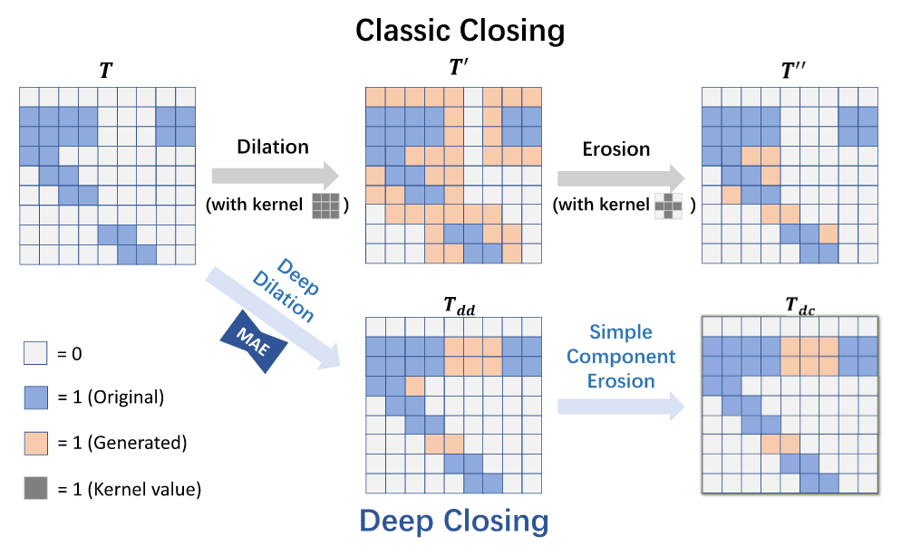
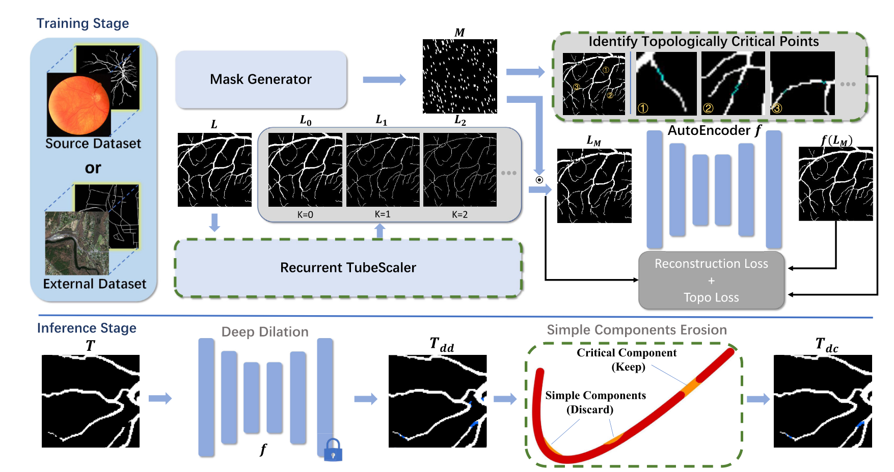
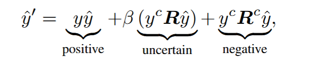
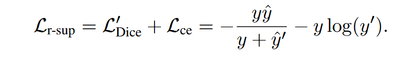
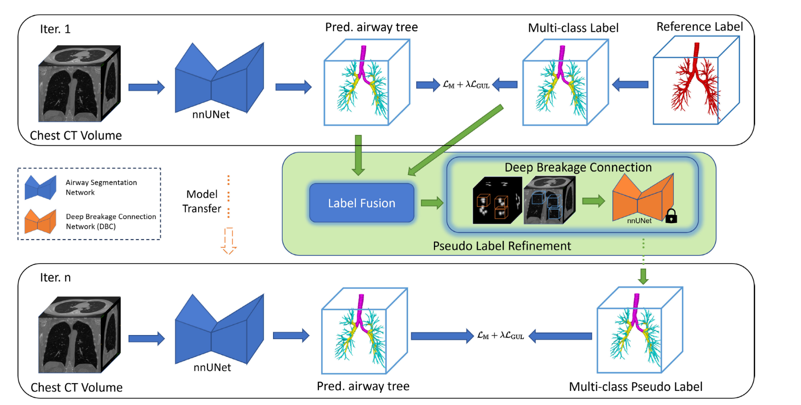

- [Tubular Structure Segmentation](#tubular-structure-segmentation)
    - [A Survey on Shape-Constraint Deep Learning  for Medical Image Segmentation](#a-survey-on-shape-constraint-deep-learning--for-medical-image-segmentation)
    - [SCOPE: Structural Continuity Preservation for  Medical Image Segmentation](#scope-structural-continuity-preservation-for--medical-image-segmentation)
    - [An Anatomy- and Topology-Preserving  Framework for Coronary Artery Segmentation](#an-anatomy--and-topology-preserving--framework-for-coronary-artery-segmentation)
    - [Dynamic Snake Convolution based on Topological Geometric Constraints for  Tubular Structure Segmentation](#dynamic-snake-convolution-based-on-topological-geometric-constraints-for--tubular-structure-segmentation)
    - [Coronary vessel segmentation in coronary angiography with a multiscale U-shaped transformer incorporating boundary aggregation  and topology preservation](#coronary-vessel-segmentation-in-coronary-angiography-with-a-multiscale-u-shaped-transformer-incorporating-boundary-aggregation--and-topology-preservation)
    - [Deep Closing: Enhancing Topological  Connectivity in Medical Tubular Segmentation](#deep-closing-enhancing-topological--connectivity-in-medical-tubular-segmentation)
    - [HarmonySeg: Tubular Structure Segmentation with  Deep-Shallow Feature Fusion and Growth-Suppression Balanced Loss](#harmonyseg-tubular-structure-segmentation-with--deep-shallow-feature-fusion-and-growth-suppression-balanced-loss)
    - [Ensuring a connected structure for Retinal Vessels Deep-Learning Segmentation](#ensuring-a-connected-structure-for-retinal-vessels-deep-learning-segmentation)
    - [A Benchmark Framework for Multiregion  Analysis of Vesselness Filters](#a-benchmark-framework-for-multiregion--analysis-of-vesselness-filters)
    - [Accurate Airway Tree Segmentation in CT Scans  via Anatomy-Aware Multi-Class Segmentation  and Topology-Guided Iterative Learning](#accurate-airway-tree-segmentation-in-ct-scans--via-anatomy-aware-multi-class-segmentation--and-topology-guided-iterative-learning)
    - [Skeleton Recall Loss for Connectivity  Conserving and Resource Efficient  Segmentation of Thin Tubular Structures](#skeleton-recall-loss-for-connectivity--conserving-and-resource-efficient--segmentation-of-thin-tubular-structures)
    - [Representing Topological Self-Similarity Using  Fractal Feature Maps for Accurate Segmentation  of Tubular Structures](#representing-topological-self-similarity-using--fractal-feature-maps-for-accurate-segmentation--of-tubular-structures)
    - [Topology Preserving Compositionality for Robust Medical Image Segmentation](#topology-preserving-compositionality-for-robust-medical-image-segmentation)
    - [CORONARY ARTERY CENTERLINE TRACKING WITH THE MORPHOLOGICAL SKELETON LOSS](#coronary-artery-centerline-tracking-with-the-morphological-skeleton-loss)
    - [Cascaded multitask U-Net using topological loss  for vessel segmentation and centerline  extraction](#cascaded-multitask-u-net-using-topological-loss--for-vessel-segmentation-and-centerline--extraction)
    - [A skeletonization algorithm for gradient-based optimization](#a-skeletonization-algorithm-for-gradient-based-optimization)
    - [Conformable Convolution for Topologically Aware Learning of Complex  Anatomical Structures](#conformable-convolution-for-topologically-aware-learning-of-complex--anatomical-structures)

# Tubular Structure Segmentation

关键词：continuity preservation, continuity of anatomy,  shape constraints, continuity constraints

---

### A Survey on Shape-Constraint Deep Learning  for Medical Image Segmentation
>
> IEEE REVIEWS IN BIOMEDICAL ENGINEERING, VOL. 16, 2023

**动机：**

U-Net等分割网络因其逐像素分割的特点极大地改变了基于深度学习的医学图像分割领域，但是这种对于像素级分类和回归的过度依赖早已被确定为一个问题，特别是在具有稀疏可用注释的医学数据库上训练时，这些方法容易产生分割伪影，如碎片结构、拓扑不一致、和像素岛。从理论图像分割到临床应用中一个很重要的需求是**解剖一致性**。

在无标签数据、或是少标签数据中，加入形状约束（Shape Constraints）显得更加重要

**讨论：**

1. 传统方法中大多基于Markov Random Fields (MRF)和Conditional Random Fields(CRF)，他们能将图像全局知识融入网络中进而产生更平滑的分割边缘，但缺点是计算复杂度高并且收敛速度慢，大多数应用MRF和CRF方法的文章是将他们用作分割后处理网络，即CNN网络过后，将分割网络结果作为MRF的输入，也有一部分是训练CNN-CRF端到端语义分割网络，如$DeepVessel$
2. 另一种解决分割后的变形问题是将CNN分割网络和active shape model（ASM）结合，类似与配准，要求分割组织是规则的，包含不变的点基准。
3. 最后一类是将CNN与active contour model （ACM）模型结合，ACM通过最小化能量函数实现轮廓的动态调整，可以通过MLP实现

**总结：**

1. 讨论的分割网络都是CNN类的方法，U-Net或者传统MLP，但是是最近的一篇survey
2. 形状约束或者时空约束可以在分割前和分割后，端到端的方法现在应该是主流

---

### SCOPE: Structural Continuity Preservation for  Medical Image Segmentation
>
> arxiv: Stanford University Johns Hopkins University, 2023
>
> 无代码

**动机：**

用于医学图像分析的深度学习模型主要旨在优先考虑形状和纹理的统计建模，而不是医学图像的形态。尽管血管等器官的破坏通常是潜在疾病的迹象，但它们往往被忽视，有利于整体分割性能。对于敏感器官（例如眼睛）的诊断，结构完整性建模的重要性变得更加突出，这些器官包含致密的脉管系统，构成了更大的挑战。这就是为什么此类模型主要被评估和应用于分析眼底图像的原因。尽管基于深度学习的方法提高了视网膜血管分割的性能，但它们往往无法保持形状的连续性，这对于准确的医学分析至关重要。为了解决这个问题，我们提出了一种新颖的基于图形的方法，该方法强制执行图像分割的**形状连续性**。

**创新点：**

1. 我们的模型直接的解决了在医学图像分割中保持形状连续性的问题，与以前依赖于在非重叠区域中选择概率最高的像素的方法不同，我们的方法将图像中的patch视为图形构建的节点，从而产生了一种更有效的方法。
2. 我们整合了 DRIU [20] 架构，在学习阶段利用了图卷积模块，并利用 clDice 损失函数 [5] 来优化我们的模型性能。
3. 与 CNN 模型不同，在CNN中来自输入的信息可以影响推理，而我们通过消息传递来强制执行图像的相邻补丁之间的关系，本质上将输入的每个部分绑定到影响最终推理的相邻补丁

**方法：**

输入图片首先分成$n \times n$的patch，每个patch都对应一个图像向量$v_i$，每个图像向量都与相邻的向量进行全连接，每个patch的特征提取部分采用的是DRIU网络中的VGG-16结构，然后图构造模块$G(.)$所有采样的图节点预期对应的特征向量进行融合，已完成这个图构建过程。但是这个构建过程中并不含有任何形状限制，为了引入拓扑信息，图卷积网络（C）将提取节点级图形特征，并将它们与初始空间特征相结合，以对节点进行最终类预测。在推理阶段，则是根据每个节点的类别进行就近插值。损失函数采用的是cldice

**总结：**

采用图神经网络对图像节点进行结构化分析，能提取网络当中的结构信息，但是文中的网格中只引入了垂直、水平和对角线连接，不能获取长距离的节点之间的关系。另外图神经网络就增强图像分割的形状连续性这点意义不明，如果每个节点都是一个像素则与逐像素分析的方法无异

---

### An Anatomy- and Topology-Preserving  Framework for Coronary Artery Segmentation
>
> IEEE TRANSACTIONS ON MEDICAL IMAGING, VOL. 43, NO. 2, FEBRUARY 2024
>
> 无代码

**动机：**

自动冠状动脉分割目前还存在三个主要的挑战：1）冠状动脉占据的体积与整个图像相比非常小（小于0.05%）使得背景与血管区域极度不平衡，深度学习的方法通常容易出现偏差，导致前景血管区域的分割性能不佳；2）冠状动脉具有曲折的树突状结构，数量，长度，大小和细长的管腔各不相同，这些特殊结构导致很难沿着血管的方向学习语义信息，在实践中导致许多难以分割的区域和不连续的分割，尤其是在冠状动脉的小分支处；3）冠状动脉的形状、丰度和路径等解剖结构都是患者特异性，导致血管空间分布具有显著多样性；

**创新点：**

1. 提出了一个从粗到精的分割方案，由解剖依赖性编码（ADE）和后续分层拓扑学习模块（HTL）组成
2. ADE模块可以在不同的心脏区域执行粗略的分割，生成五个距离场图，编码冠状动脉和分段主动脉和心腔之间的解剖依赖关系
3. 后续HTL模块在多任务学习方案下引入多层拓扑约束，包括关键点、中心线和邻居连接。此外，采用自下而上的注意力交互模块来集成这些约束，引入了一种新的关键点检测方法，可以精确定位关键点位置

**方法：**

ADE模块分为两个部分，第一部分我们使用两个不同的ResUNets，一个用来预测心腔掩码，一个用于预测冠状动脉掩码，为了确保分割结果中包含所有细小的血管分支，我们采用**扩张标签**进行训练，在扩张标签的监督学习下，平均dice可以达到87.36%，包含92.86%的血管片段；第二部分是计算解剖距离场，首先我们从每个不同的心腔掩码中提取五个点集，即左心室、右心室、左心房、右心房和真个主动脉，表示为 $\{O_1, O_2,...,O_5\}$，每个点集包含8000个点， 而分割出来的血管掩码点集表示为$P=[p_1,p_2,..., p_N]$，距离场图是通过计算每个血管点和心腔点集之间的最小欧拉距离，这些距离会进一步归一化，并裁剪为上限为1，如公式 1，2所示。

HTI模块将距离场图和近距离感兴趣区域作为输入，分为三个部分。

一、关键点（包含分叉点，终止点）检测，使用RestUnet作为backbone从输入图像生成概率图，概率图为每个点成为关键点的概率值，接着计算加权 Hausdorff 距离 （WHD），估计预测点和真实值之间的相似度，具体的计算方法可见Volumetric landmark detection with a multi-scale shift equivariant neural network 和 Volumetric landmark detection with a multi-scale shift equivariant neural network

二、对于血管的中心线分割，我们引入了一个中心线热力图单元和一个3D自适应高斯滤波器去生成局部中心热力图，这一部分因为没有代码我也没看懂具体的做法是什么

三、领域连通性预测，文中提出了一个高效的方法去除分割掩码中的孤立点，获得初始的概率图，二值化后统计每个中心像素周围$3\times3\times3$区域内标记为1的数量，此时孤立点的统计值就会为1，再设定阈值为2进行二值化获得最后的分割掩码，关键是整个算法过程可以通过滑动窗口和矩阵操作快速计算

BAI模块引入交叉注意力机制学习不同分支特征之间的关系，$F_2$代表稀疏的特征分支，如中心线特征，$F_1$代表相对密集的分支，如连续性特征分支。大概意思是将上述经过不同处理后的特征之间进行融合。

**总结：**

1. 由粗到细的分割方式比较适合前景较少的分割场景中，和单神经元的场景也比较类似
2. 后处理联通性的方式可以借鉴，应该比较好实现

**问题：**

没有代码，关键点检测那里光看文章不是很理解，backbone用的是比较早的方法，可以替换

---

### Dynamic Snake Convolution based on Topological Geometric Constraints for  Tubular Structure Segmentation
>
> 2023 IEEE/CVF International Conference on Computer Vision (ICCV)
>
> *https://github.com/YaoleiQi/DSCNet*

**动机：**

分割拓扑管状结构目前存在以下三个问题：1）细小的管状结构只占整个图像的一小部分，这些结构也容易受到复杂背景的干扰。2）管状结构复杂而又多变，分支的数量、分叉的位置和路径长度都可能使得模型偏向过度拟合已经看到的特征，导致泛化较弱。3）管状结构分割易发生断裂。

**创新点：**

1. 为解决第一个问题，我们设计了一个新的卷积结构——动态蛇形结构Dynamic Serpentine Convolution (DSConv)，能够动态的关注管状结构细小而弯曲的局部特征，同时有针对性的学习管状结构特点
2. 为了应对复杂多变的全局形态学的挑战，我们提出了一种多视图特征融合策略。该方法基于DSConv生成多个形态学内核模板，用于从多个角度观察目标的结构特征，并通过总结典型的重要特征来实现高效的特征融合。
3. 为了解决管状结构分割容易断裂的问题，我们提出了一种基于持续同源 （PH） 的拓扑连续性约束损失函数 （TCLoss）

**方法：**

（1）可变形的卷积核DSConv，和一般的卷积核的不同在它的形状不是规则的，除中心之外的每个像素都可以在X轴或Y轴上有一个像素的偏移，如下图所示，17个单元就可以覆盖$9\times9$的区域，形变原则则是保证每个感受野单元之间是相连接的（至少保证对角线连接），这也保证了提取到的特征是连续的，但是怎么快速计算这种卷积核的部分没有看懂，文中使用了双线性插值，不懂这是为什么，得结合代码部分理解

（2）关于TCL损失函数的建立，涉及到很多**拓扑数据分析（TDA）** 的内容，文章中描述的很简略，一点也看不懂，在CSDN上找了一下关于这篇文章的分析，有读者反映代码中也没找到TCLoss的部分。

**总结：**

为了更好的针对细小管状结构分割，文章设计了很多特异性的方法，变形卷积核以及结合拓扑数据分析的损失函数，理解起来有点困难

**问题：**

变形的卷积核在计算过程中是怎么实现的，如果用于三维数据则会极大的增加训练的复杂度，拓扑数据分析方法的原理

---

### Coronary vessel segmentation in coronary angiography with a multiscale U-shaped transformer incorporating boundary aggregation  and topology preservation
>
> Phys. Med. Biol. 69 (2024) 025012
>
> 无代码、数据不开源

**动机：**

冠状动脉疾病的诊断依赖于在冠状动脉造影图像中可视化血管形态，因此，保持分割血管的连通性和边界准确性对于准确诊断是必要的。而现阶段一方面缺少公开的有标签冠状动脉显影图像数据集、血管的标注；另一方面血管的形态结构复杂多变，血管薄而错综复杂。因此，很难保证分割的连续性和准确性。

**创新点：**

1. 开发了一个混合结构模型 UT-BTNet，其中包含 CNN 和 transformer 结构。该模型兼具两者兼而有之的优点，可以有效地提取局部和全局特征，同时解决了 transformer 需要大量数据的缺点，使其更适合冠状动脉血管分割。
2. 引入了边界损失和拓扑损失进行训练，分别具有边界聚合和拓扑保持功能。冠状动脉的边界精度和连续性在大多数情况下得到了有效解决。

**方法：**

backbone结构采用UTNetV2的结构，整体采用编码-解码框架，首先由多个卷积层和下采样组成编码器对冠状动脉图像的局部特征进行建模，在每个卷积层后跟上一个bi-transformer学习长距离特征。解码器类似。

边界损失：由[kervadec](Kervadec H, Bouchtiba J, Desrosiers C, Granger E, Dolz J and Ben Ayed I 2021 Boundary loss for highly unbalanced segmentation Med. Image Anal. 67 101851)等人的边界损失函数发展而来，原本的方法比较好理解，就是找到和真实边界$\delta G$上的点到分割边界$\delta S$相对应的最短距离，本文将距离计算改成了积分面积计算，具体的公式推导文中细节太少了。

拓扑保留：用到了持久同源(Persistent homology)的原理，原理解释如，具体损失函数方程如下：$f$和$g$分别表示分割结果和真实值，$Dgm$表示持久同源方法计算出来的持久性图，$b(t)$和$d(t)$表示图像拓扑特征出现和消亡的时间在阈值变化的过程中，$\gamma^*(t)$表示最佳的一对一匹配。注意文中在epoch>20的情况下才加入拓扑保留损失函数。

**总结：**

文章的主要创新点在损失函数的设计上，针对分割问题类不平衡、连续性等问题加入了针对性的损失函数，但创新性比较低，属于是将很多的方法进行融合，关于损失函数的具体设计，由于没有代码，文中有很多细节问题不能理解。

**问题：**

在持久同源提取出的特征利用上应该不全面，仅比较了拓扑生成点和消失点之间的差异，有没有别的方式衡量不同图像上的拓扑相似性。

---

### Deep Closing: Enhancing Topological  Connectivity in Medical Tubular Segmentation
>
> IEEE TRANSACTIONS ON MEDICAL IMAGING, VOL. 43, NO. 11, NOVEMBER 2024
>
> https://github.com/5k5000/DeepClosing
>
> 开源数据集：DRIVE, CHASE_DB1, DCA1, and CREMI

**动机：**

现有的管状分割方法在拓扑性能方面往往存在局限性，特别是在保持联通性方面。针对这一问题，现有的方法主要可以分为三类：1）**拓扑感知方法（topology-aware）**：在优化过程中施加额外的拓扑约束或则网络设计，这类方法通常是增加拓扑连续性损失函数而使网络学习到更多的结构特征，但是在训练过程中损失函数还是会包含有dice等准确率相关的指标，并且通常以分割准确性作为主要优化方向，这类方法不是在本质上对拓扑性能进行改进；2）**标签细化增强拓扑性能****（label refinement）**：这类方法通常级联多个网络，并使后面的网络充当前一个网络的标签错误修复器，这类方法的问题是存在过度拟合特定特征的风险，泛化性较弱，并且它们主要仅适用于所训练的原始模型；3）**分割后处理方法（post-processing)**：此类方法是在分割之后处理一些断连的问题，这类方法在自然图像的上下文中有效，但应用于医学管状数据集时往往表现不佳，由于医学图像的特殊性，结构的复杂性和拓扑的重要性带来了标准后处理技术无法处理的挑战。

**创新点：**

1. 提出了一种新的范式，结合传统closing算法和深度学习增强管状结构分割的连通性
2. 结合数字拓扑知识设计了 Simple Point Erosion模块，删除对拓扑结构影响不大的点，从而识别拓扑关键点。

**方法：**

整体方法采用的思路和classic closing一致，包含两个步骤：扩张（dilation）和侵蚀（erosion），传统的closing方法采用提前确定的核扩张和侵蚀边界，本文则采用MAE的结构学习拓扑特征扩充断联的部分，再通过简单点消蚀过程将不影响拓扑结构的简单组件消除。

扩张的阶段是一个MAE，但是在分割标签的处理上经过了两步操作，首先是通过Mask generator生成动态掩码，分割标签$L$经过模块 Recurrent tubeScaler逐步消蚀不影响拓扑结构的简单点，（这一步操作和推理过程中的简单组件侵蚀很像，但是超参数K不会取到无穷，文中给的解释是作为数据增强），再将掩码加上输入Auto Encoder中进行重建，重建损失函数包括MSE和topology损失，本文的topology损失可以看做是从图像中选择拓扑关键点计算MSE，$M_{ns}$是经过Recurrent tubescaler模块消蚀后的掩码，关键拓扑点如图上蓝色部分可见。

MSE Loss

topology L

第二阶段侵蚀过程文中设计了比较复杂的算法，主要分为四个步骤。第一步是构建简单点查找表，作者通过引理说明判断一个点是否为简单点仅需要分析它周围$3\times3$的区域即可，即比较区域内的模式就可以判断中心点是否为简单点，作者将$3\times3$的模式二进制序列化便于查找；第二步，传统的简单点匹配分类需要按顺序进行，文中进行了改进，通过4个不同的分隔掩码将图片分成四个部分并行进行查找匹配；第三步，如果简单点模式匹配成功，则将简单点消除，这一过程是递归的，4个部分并行的处理直到所选图像中没有简单点；第四步，前面三步可以说是侵蚀过程的铺垫，文中的侵蚀不是针对单一点进行侵蚀的，而是针对组件（components，一系列彼此相连的点构成的片段）进行消除，也就是说只有当一个组件是简单组件，才将整个组件消除。这里文中的解释比较复杂，可以简单理解为组件内所有的点都是简单点并在第三步中被消除后，整个联通的组件才会被消除。这么做的目的不是很清楚，我猜测应该是为了避免因侵蚀造成的过多离散点。

**总结：**

1. 这篇文章对冠状结构连续性问题采用的技术路线进行了分类分析，并指出了不同路线中可能存在的问题，具有一定的借鉴意义
2. 按文中的分类方式，本篇文章的思路属于是级联的方法，可以在不同的benchmark分割网络之后级联提高分割的连续性，可操作性比较强，从最终的结果上来看，文中方法对于整体指标dice的提高不是很明显，在连续性相关的指标cldice上可以普遍提高0.001左右，也不是很明显。
3. 在侵蚀过程应用了简单点消蚀不改变拓扑结构的原理，但实际侵蚀结果受扩张过程训练的结果影响，MAE融合了一部分拓扑结构的信息，但好像对于整体准确率的提高没有效果，是不是可以加入更多的拓扑相关特征的引入。

---

### HarmonySeg: Tubular Structure Segmentation with  Deep-Shallow Feature Fusion and Growth-Suppression Balanced Loss
>
> arxiv2025 from DAMO Academy, Alibaba Group
>
> 暂时没有代码
>
> 公开数据集：
>
> Hepatic vessel segmentation (HVS)：LiVS [8] (532 volumes), MSD8 [32] (440 volumes), and 3DIRCADb [33] (20  volumes)
>
> Retinal vessel segmentation (RVS)：The DRIVE  dataset
>
> Airway tree segmentation (ATS)：90 chest CT volumes

**动机：**

管状分割常见问题：尺寸多样、拓扑复杂、分布稀疏，人工描绘管状结构既困难又耗时。此外，再低对比度的医学图像中，小管状结构的可见度通常受到限制。针对这些问题，现有的方法中，有提出各种过滤器来增强和分割医学图像中的管状结构，这些过滤器通过产生血管性分数计算每个像素与管状结构的相似程度，但这种方法容易受到图像质量的影响；端到端的深度学习模型也受限于带标签数据集的数量和质量，一些方法通过骨架生长（skeleton growth）来提高分割连续性，但是很难保持骨架生长和生长产生的噪声之间的平衡；也有一些方法将管状过滤器和深度学习特征学习相结合，但是只考虑将图像和过滤结果进行浅层的融合，忽视了管状结构增强小型结构的更深层特征提取能力。

**创新点：**

1. 引入了一个浅层和深层融合模块（SADF），目的是充分利用管状网络提高召回率，同时根据图像特征过滤掉不需要的管状分支来确保精确度
2. 设计了一种从深到浅的解码策略（D2SD），利用SADF的增强特征逐步细化分割结构，进一步对齐和聚合不同尺度的血管和图像特征，提供对目标大小的不同敏感度并有效保留结构。
3. 设计了有效平衡管状结构生长和噪声抑制的损失函数，可以补偿漏标签、提高召回率并减少假正率

**方法：**

**浅层和深层特征融合**（SADF），通过血管过滤器获得血管过滤图（血管过滤器是怎么设计的？），将血管过滤图视为一个新的模态，并通过SADF模块将两个模态特征进行融合。如上图中b所示，经过交叉注意力和自注意力获得$DQ_{V2C}$，血管过滤图突出了 CT 的整体血管密集区域，同时 CT 本身的整体依赖性也受到保护，免受血管噪音的严重影响。在$F_{V4}$和$F_{C4}$ 之间也进行类似的处理以获得 $DQ_{C2V}$ ，其目的是减轻 CT 中明显血管（例如位于肝脏边界的血管）对血管的异常值的负面影响。

**浅层查询**（SQ），浅层特征图比深层特征图包含更准确的空间信息，因此我们利用血管过滤图来帮助定位 CT 图像中的潜在血管。首先，我们将 CT 和血管的浅层特征融合，然后在通道维度上将它们平均分成$F_{S1}$和$F_{S2}$，以降低自注意力机制的计算成本。然后，$F_{S1}$被反馈到 Self 中，其中池化作用于提高对受 [24] 启发的微小目标的敏感性。优化的 F S′ 1 表示全局尺度下的候选血管，并进一步与 F S2 连接以恢复原始形状。最后，SQi 与通过上采样后的$DQ_{V2C}$和$DQ_{C2V}$ 相加，融合所有血管的信息并输入到并行多解码阶段，

**可变卷积块**，为了提取到不同分辨率的特征，如下图所示，为了避免扩张卷积（dilated convolution）字提取血管局部细节时产生的网格化效应，我们采用灵活的卷积块通过并行堆叠的方式而不是扩张卷积来提供不同的感受野

**骨架增长抑制平衡（GSB）**：

和扩张侵蚀思路类似，骨架增长抑制方法也是先扩张分割边界（骨架生长），再消除多余的点（噪声抑制）。和一般后处理的方法不同的是，本文的生长阶段是通过放松损失函数实现，对于真实标签$y$和预测标签$\hat{y}$，文中设计了一类uncertain-aware标签$\hat y'$, 并改变为宽松的损失函数，原理上应该是将二值化的标签0，1之间加入了模糊值，使得模型预测的骨架更粗大。

**一致性损失函数：**

为了重建断连的血管区域，保持与周围血管的密度一致性，我们设计了一个连续性损失函数，其中$\hat y^s$表示骨架化标签，根据cldice这篇文章获得；$\hat y^s$表示重新连接骨架标签，对于每个较小的组件，我们识别出所有的终端节点，然后在每个组件之间画一条线，将每个组件的端点连接到最近的端点，这是这篇文章的方法Ensuring a connected structure for retinal vessels deep-learning segmentation

上下文噪声抑制 （Contextual noise suppression）

文中设计了两个损失函数来约束生长过程产生的噪声，首先，采用浅层特征相似性来控制生长，确保扩展区域在密度分布和空间对齐方面与原始容器区域保持一致。$\Omega _r$表示半径为 r 的一个邻域，$k_{ij}$表示一个高斯核

接着，我们使用 MixUp 技术作为辅助输入进一步生成混合样本，以强制混合等效性。给定两个输入图像$x_1$和$x_2$混合图像定义为$x'=\alpha x_1+(1-\alpha)x_2$, $\alpha$从均匀分布中采样，然后，这些混合输入的预测输出受以下损失函数的约束

最终的损失函数平衡了生长和抑制两部分：

**总结：**

1. 从实验结果上看，文章的方法相比其他的方法有了明显的提高，也能较好的解决管状结构断连的问题
2. 在主干网络上，整体上文章还是采用的类似unet的结构，但是融入了多模态学习，将原始图像和加了filter的图像进行浅层和深层的特征融合，可以帮助模型更快的关注到图像中血管密集的区域，过滤器的设计需要再看看参考文献
3. 文章将对注意力机制的应用非常灵活，在浅层和深层特征中设计了不同的注意力方案，并且将深层特征和浅层特征也进行了融合，这块细节挺多，有点想不明白为什么这样设计。
4. 骨架增长和抑制模块作者设计了4个损失函数，相比其他方法中应用持续同调特征或者其他的损失函数，本文的方法非常直接的针对连续性、一致性等问题进行建模，可解释性比较强，但是四个损失函数之间的参数调整应该也是一个难题。
5. 总的来说这篇文章创新的地方很多，但问题是暂时没有代码，很多细节的地方不是很清楚。

---

### Ensuring a connected structure for Retinal Vessels Deep-Learning Segmentation
>
> 2023 IEEE/CVF International Conference on Computer Vision (ICCV)
>
> 暂时没找到代码

**动机：**

虽然基于深度学习的分割方法在处理详细和病理性眼底方面表现出显着性能，但它们会产生断开连接的组件，而视网膜血管是一个连接的结构。大多数的文章研究如何连接断裂的片段，而对于伪影去除方面的研究较少。

**方法：**

间隙填充过程：

第一步是找到可以连接的片段：首先骨架化血管、提取端点（即只有一个白色邻居的白色像素）、提取交叉点（即具有三个或更多白色邻居的白色像素）并确定端点-端点和端点-交叉点的相互最接近对，距离是使用 Euclidean 度量计算的。第二步筛选片段：首先去除本身就在同一个片段上的端点对，接着找到最小的片段，在这个最小的片段中，我们提取离候选者最近的端点或交叉点。随后，我们计算这三个点在最小片段内对端点对形成的角度。如果角度与直线的最大偏差为 45 度，则保留该端点对。此外，我们采用 Bresenham 线算法沿候选对之间的一条线提取像素值。这使我们能够检测路径中是否存在现有血管。在这种情况下，我们不会重新连接。最后将筛选好的连接点按照最小片段的厚度进行连接

连接和去除过程

 为了确定重新连接的候选项，我们首先区分最大的片段 和所有较小的 片段。对于每个较小的片段，我们提取其所有终端节点。然后，对于每个终端节点，我们将其最近的终端节点或交叉点定位在同一 片段中。随后，我们沿着连接最近端点或交叉点到原始端点的一条线获得像素。最后，如果沿这条线存在一个主点（最大 片段内的点），我们将端点及其最近的主点视为候选对。否则，将删除较小的片段。此外要求连接的间隙长度必须小于较小的片段长度，如果来自同一片段的的多个终端节点是重新连接的端点对，则只会重新连接符合条件的的第一个终端节点，并且删除队列中其他的待连接片段。

预测分割（左）、后处理分割（中间）和添加的重新连接路径（绿色）和已删除的元素（紫色），手动标记的 groundtruth（右）。

**总结：**

1. 文章提出的方法属于是后处理的一种，不仅能将断连的片段重建并且删除偏离较远的片段，但是文中也指出可能会删除一些本属于GT中的片段，如上图的紫色部分
2. 文中所针对的图像是视网膜血管分割，同一图像中视网膜血管应该只有一个简单连接结构，也就是说所有的片段本质上都是相连的。但在神经元图像中会有多个个体，分支比较少，应用这个算法可能复杂度较高，因为需要判断不同片段到底是属于哪个神经元轴突中
3. 关于连接的粗细问题，文中简单以最小的片段粗细作为填充的粗细，这也是个问题

---

### A Benchmark Framework for Multiregion  Analysis of Vesselness Filters
>
> IEEE TRANSACTIONS ON MEDICAL IMAGING, VOL. 41, NO. 12, DECEMBER 2022
>
> filters code：
>
> https://github.com/JonasLamy/LiverVesselness
>
> 在线演示器：
>
> https://kerautret.github. io/LiverVesselnessIPOLDemo.
>
> 数据集：
>
> Ircad 数据集，由 20 张 DICOM 格式的 3D 胸部 CTA 图像（10 名男性，10 名女性）组成。
>
> VascuSynth 数据集，由 120 张具有不同分叉数的模拟维管树图像组成。
>
> Bullitt 数据集，包含33 张 MRA 图像，具有手动优化的稀疏注释区域

**动机：**

血管增强（vessel enhancement，vesselness）过滤器是血管造影图像处理的一部分，已有 20 多年的历史。它们的受欢迎程度来自于它们能够增强管状结构，同时过滤掉其他结构，特别是作为血管分割的初步步骤。在众多可用的过滤器中选择合适的血管过滤器可能很困难，它们的参数化需要对其基本概念的准确理解和真正的专业知识。

**创新点：**

1. 我们提出了一个通用框架来比较血管过滤器。我们使用此框架来比较 7 个黄金标准过滤器。
2. 我们评估了它们在关键区域的表现：感兴趣的器官、整个血管网络邻域和血管邻域，根据血管的粗细进行横向对比，我们还关注血管分叉，这些分叉经常被血管性过滤器遗漏
3. 我们提供基准测试的代码，其中包括七个滤波器的最新 C++ 实现，以及实验设置（参数优化、结果分析等）。还提供了一个在线演示器，以帮助社区应用和直观地比较这些血管性过滤器。

**方法：**

测试了六种不同的血管过滤器Frangi, Jerman, Sato, Zhang, Meijering, and RORPO在血管分割问题上的性能。首先，我们评估全局区域的结果，以考虑所有可能的错误来源。其次，我们专注于血管分支邻域，以忽略可能出现在远离分支且在某些应用中可能无关紧要的错误。除此之外，我们还通过根据血管分支的大小（大、中、小）分别研究过滤器的性能来改进此分析。最后，我们探讨了分叉区域，其中的血管性滤波器通常被认为效率较低。

**总结：**

血管过滤器是基于传统的图像分析算法设计的，HarmonySeg:中使用其中不同的过滤器过滤的结果作为不同模态的特征输入，也可作为数据增强的方法之一。

---

### Accurate Airway Tree Segmentation in CT Scans  via Anatomy-Aware Multi-Class Segmentation  and Topology-Guided Iterative Learning
>
> IEEE TRANSACTIONS ON MEDICAL IMAGING, VOL. 43, NO. 12, DECEMBER 2024
>
> https://github.com/LiquidFun/Airway
>
> 数据集：
>
> BAS Dataset，包含在二元气道分割 （BAS） 数据集中收集的 90 次胸部 CT 扫描
>
> In-House Lung Cancer Dataset，private
>
> EXACT’09 Challenge Dataset:，EXACT'09 挑战提供了一个训练集和一个测试集，每个测试集都有 20 次 CT 扫描，没有公开可用的训练注释。
>
> ATM’22 Challenge Dataset，ATM'22 挑战赛包含一个500 次胸部 CT 扫描（300 次用于训练，50 次用于验证，150 次用于测试）的大规模数据集，涵盖健康受试者和严重肺部疾病患者。ATM'22 中的气道参考标签是半自动生成的。

**动机：**

其一，气道具有具有局部拉长分支的树形拓扑结构，这些**分支在不同的分支级别具有较大的尺度和上下文变化**。例如，气管和小支气管的直径可能相差 10 到 20 倍，而位置和周围组织也不同（纵隔与肺实质）。大量的**类别不平衡**和**上下文差异**增加了学习难度，尤其是对于那些位于外围位置的细分支。其二，由于远端支气管的高度不确定性导致气道管腔和壁之间的对比度差，因此几乎不可避免地存在断开连接的分支，即**节段断裂**，连接这些断连的节段将有利于提取的气道树的敏感性和完整性。最近的工作研究了新的拓扑保留损失 （clDice） 来加强分割连接，但与其他最先进的气道分割方法相比，它需要更长的训练时间，并且性能明显较差。其三，与其他形状或拓扑结构更简单的器官不同，气道复杂的树状结构给生成 “ground truth” 标签带来了难以承受的负担，因为一个2D切片中经常包含数十个不同的气道，而一共有数百个切片需要注释。手动或半自动注释可能需要 7 或 3 小时才能完全标记一个案例。因此，大多数气道数据集的**标记不完整。**

**创新点：**

1. 我们提出了一种新的解剖学感知多类分割方法，该方法通过拓扑引导的迭代自学增强，以应对气道分割挑战。在其树结构的约束下，制定了一种简单而高效的解剖感知多类 （AMC） 分割，以直观地处理严重的类内不平衡和不同树枝级别分支的大上下文变化。
2. 此外，我们纳入了一般愈合损失 （GUL），以进一步缓解气道分割中严重的类内失衡问题。

**方法：**

整个训练过程是一个不断迭代的过程，在整个训练过程中，使用原始标签和优化的伪标签迭代更新深度分割模型。在每次迭代中，采用 Anatomy-aware Multi-Class，AMC 结合recent general union loss，GUL 来训练深度模型。注意对于深度断裂连接网络，它是使用初始数据集开发的，随后适用于所有实验，**无需进一步重新训练**。此外文中为了训练深度断裂连接网络，还从原始连续标签中**模拟了一批断裂数据**进行训练。

针对树状结构的粗细不同问题，我们根据不同的粗细将树形气道分成三个部分，进行**三分类的分割**。标签的获得是全自动的，包括以下步骤：曲线骨架化 [33]、骨架标签 [34]、骨架到体积标签传播 [35] 和基于规则的解剖分支匹配。

在每个迭代之间我们进行拓扑引导的伪标签细化（Topology-Guided Pseudo-Label Refinement）。首先是获得伪标签，使用联合运算符将第n次迭代中国预测的气道标签$\hat Y$和原始标签$Y$结合得到$\hat Y'$, 这样结合可以补上预测遗漏的假负点。接着通过一个breakage-connection 网络删除预测中与主树断开连接的组件。breakage-connection 网络通过**Breakage Attention Map**来训练网络，我们通过计算破损注意力图（breakage attention map）来突出破损区域。设$C_k$是$\hat Y'$中连通部件的数量，对于每个连通的部件$\hat Y_k'$，计算背景体素$j$和分量$\hat Y_k'$之间的**3D欧几里得距离变换图**。然后，将体素 j 处的原始breakage attention 值 $H$确定为到所有断裂片段中的第二短距离。**为什么用的是第二短距离？文中做了对比，使用第二短距离更能将注意力集中到断裂部分**

图：我们提出的名为 DeepTree 的气道分割方法的整体训练工作流程。注意，对于深度 Breakage Connection 模块的训练，只有围绕 Breakage 注意的补丁被用作网络的输入。

图 breakage attention map 计算可视化过程

**总结：**

1. 文中的网络结构都是基于nnunet的，创新之处是设计了可迭代的训练方式，在不同阶段之间加入了中间网络训练断连部分的重连接能力同时将标签精炼，用于下一次迭代的训练。从结果角度看，和其他方法对比有比较大的准确率提高，但由于要训练两个不同的网络，虽然deep breakage 网络可以独立训练不用迭代，但也增加了训练的时间成本，推理阶段则更为明显，本文的方法推理时长基本为同类方法的两倍。
2. 相比通过网络训练的方式获得重建的伪标签，可以通过非深度学习的方法进行重建以提高推理速度
3. 还没有看代码，暂时不清楚breakage attention map是怎么引入到网络中指导断连部分重建的，使用深度学习的方法进行重建不是很直观。

---

### Skeleton Recall Loss for Connectivity  Conserving and Resource Efficient  Segmentation of Thin Tubular Structures
>
> Computer Vision – ECCV 2024. ECCV 2024
>
> https://github.com/MIC-DKFZ/Skeleton-Recall
>
> 数据集：
>
> Roads、DRIVE、Cracks、ToothFairy、TopCoW

**动机：**

标准的基于深度学习的分割损失函数（例如 Dice 或 Cross-Entropy）专注于体积重叠，通常以损失结构连接性或拓扑为代价。这可能会导致分段错误，从而对下游任务（包括流量计算、导航和结构检查）产生不利影响。尽管当前以拓扑为中心的损失做出了一些改进，但它们会带来大量的计算和内存开销。现有的骨架化算法大多数是可微分骨架化，如cldice Loss，但这种方式可能会导致软骨架化（骨架穿孔或成锯齿状），尤其是在3D中。同样基于Gpu的可微分骨架化也会产生巨大的GPU内存和训练时间开销。使用骨架来保持连接是一种有效的方法，但它**不需要是可微分**的

**创新点**，Skeleton Recall Loss的优势：

1. 可以使用常见的图像处理框架（例如 scikit-image）通过简单的基于 CPU 进行计算，作为数据加载的一部分，甚至可以预先计算。然后，它与预测一起用于简单的附加软召回损失，因此只需要**很少的额外训练时间**。
2. 使用 Skeleton Recall Loss **需要最少的 GPU 内存开销**。与在训练期间依赖于可微分骨架进行预测或地面实况的方法不同，骨架召回损失回避了基于 GPU 的计算繁重的骨架化过程，因此只需要略微增加 GPU 训练内存。
3. Skeleton Recall Loss 具有固有的**即插即用**特性，可无缝集成到各种 2D 和 3D 分割任务中，而不会受到架构限制。它无需专用网络或修改底层分段架构即可运行。
4. Skeleton Recall Loss 与**多类标签**无缝集成，而像 clDice Loss 这样的竞争方法在此类问题上经常面临几乎无法克服的计算挑战。

**方法：**

管状骨架化算法：

首先，我们将ground truth分割掩码二值化，并使用 [42] 中概述的 2D 和 [14] 中概述的 3D 输入方法计算其骨架。随后，我们用**半径为 2 的金刚石核扩张**骨架，使其呈管状，从而扩大了损失计算的有效区域。通过整合更多的像素来提高损失函数的稳定性，特别是那些靠近骨骼的像素，这对连接至关重要。最后，对于多类问题，我们将管状骨架与Ground truth 掩码相乘，从而有效地将骨架的各个部分分配给各自的类。所有这些在计算上都是低成本的，并且可以在数据加载期间在 CPU 上执行，也可以使用 scikit-image 等库进行预计算。

骨架化后的Soft Recall 损失函数，与使用可微分骨架化相比，骨架召回损失的计算成本较低，在训练期间只需要些许更多的 GPU 内存和额外的时间

所用数据集：

**总结：**

从本文的结果上来看Skeleton Recall Loss分割的效果比cldice Loss更好，时间效率上也有很大的提高，并且可以支持多分类分割任务，可以将这个损失函数与其他损失函数对比分析。

---

### Representing Topological Self-Similarity Using  Fractal Feature Maps for Accurate Segmentation  of Tubular Structures
>
> arXiv:2407.14754v1 [eess.IV] 20 Jul 2024，This paper has been accepted by the European Conference on Computer Vision 2024.
>
> Institute of Automation, Chinese Academy of Sciences、DAMO Academy, Alibaba Group、Hupan Lab
>
> 代码：https://github.com/cbmi-group/FFM-Multi-Decoder-Network.
>
> 数据集：

**动机：**

管状结构的复杂拓扑和几何形状为分割带来了重大的技术挑战，现有的深度学习分割方法，无论是通过调整网络结构还是设计拓扑相关的损失函数，其主要目的是利用国有限的图像输入实现高分割性能，而不为分割模型提供额外的信息。管状结构的一个显著特征是它们的拓扑自相似性，即大型和复杂的管状结构在不同尺度上表现出相似的拓扑模式。因此，我们利用分形理论来表征不同尺度上管状结构的自相似性，利用了管状结构的拓扑自相似性以及边缘和骨骼特性辅助分割模型。

**创新点：**

1. 我们开发了一种策略，将分形特征整合到深度学习网络中。具体来说，我们将分形维度从图像级别扩展到像素级别，并生成分形特征图 （FFM），它表征了图像或其相关标签中每个区域的拓扑自相似性和纹理复杂性。从图像计算的 FFM 表示为 $FFM_{image}$，而从标签提取的 FFM 表示为$FFM_{label}$。**使用 $FFM_{image}$ 作为额外的模型输入，使用$FFM_{label}$作为额外的损失函数权重，大大提高了分割性能**
2. 我们通过使用**边缘解码器**和**骨架解码器**扩展 U-Net 架构来开发多解码器网络 （MD-Net）。这些解码器使模型能够同时预测图像对象的**边界和骨架**，以及主要的**分割掩码**。通过在损失函数中加入相关约束，我们的模型不仅专注于实现准确的目标分割，而且还增加了对边界描绘和骨架保留的关注，从而提高了整体预测质量。
3. FFM 模块即插即用，可以在不同模型结构上加入使用

---

### Topology Preserving Compositionality for Robust Medical Image Segmentation
>
> Proceedings of the IEEE/CVF Conference on Computer Vision and Pattern Recognition (CVPR) Workshops, 2023, pp. 543-552
>
> 暂时无代码
>
> 数据集：
>
> Abdomen（BTCV） ：30 例 CT 扫描，含 13 个标签，来自单一域，训练时采用 96×96×96 随机裁剪 patches。
>
> Cardiac（M&Ms） ：多中心、多厂商、多疾病心脏 MRI 数据集，分 4 个域（A/B/C/D），共 320 例（A 域 95 例、B 域 125 例、C/D 域各 50 例），含 3 类分割标签，图像裁剪为 288×288。
>
> Prostate（NCI-ISBI13） ：60 例 MRI 扫描，分 2 个域（不同扫描仪类型），各 30 例，含 2 个分割标签，图像中心裁剪为 256×256。

**动机：**

深度学习-based医学影像分割模型在面对细微的分布偏移（如噪声、不同采集协议导致的外观变化）时容易失效，鲁棒性不足。医学影像的独特性在于患者间的结构变异性有限（解剖结构一致性高），但现有方法存在以下缺陷：

- 数据增强、对抗训练等提升鲁棒性的策略未充分利用医学影像的结构一致性；
- 缺乏对分割结果拓扑结构的约束，导致组件组合时出现拓扑错误（如连通组件数量、孔洞不符）；
- 未实现基于拓扑先验的深度监督，难以在多尺度下保持拓扑准确性。

**创新点：**

论文提出**拓扑保持组合性（Topology Preserving Compositionality, TPC）** 方法

1. **通过组件字典约束潜在空间**：将分割模型的潜在空间约束为通过向量量化学习的组件字典，利用医学影像结构一致性提升鲁棒性，组件代表特定空间结构。
2. **基于持久同调的拓扑先验**：首次在组件采样中引入持久同调（persistent homology）作为拓扑先验，确保组件不是独立采样，而是能组合成拓扑正确的分割结果（如正确的连通组件和孔洞数量）。
3. **分层深度拓扑监督**：首次将持久同调用于深度学习分割模型的深度监督，分层（类级和前景级）施加拓扑约束，确保高抽象度的空间组件能正确组合为最终分割结果（如心脏各部分组合成完整心脏）。

**方法**

TPC方法通过约束潜在空间为组件字典，并施加拓扑约束确保组件组合的拓扑准确性，具体步骤如下：

**1 组件字典的学习**

通过向量量化（vector quantisation）将连续的潜在空间离散化为一组组件字典\(D\)。编码器将输入映射到潜在空间\(E\)，通过1×1卷积减少特征维度后，计算每个潜在向量\(z_i \in E\)与字典中最近组件\(e_k \in D\)的欧氏距离，通过“直通梯度估计”实现反向传播。量化损失公式为：

$$
\mathcal{L}_{Quant }=\frac{1}{m} \sum_{i=0}^{i=m-1}\left(\left\| s g\left(z_{i}\right)-e_{k}\right\| _{2}+\beta\left\| z_{i}-s g\left(e_{k}\right)\right\| _{2}\right)
$$

其中$sg$为停止梯度操作，$\beta =0.2$，目的是最小化潜在向量与字典组件的距离。

**2 形状解纠缠（Shape Disentanglement）**

为确保组件无空间重叠（仅代表形状特征，剥离纹理信息），施加解纠缠损失，强制量化后经softmax的特征$\tilde {z}_i$ , $\tilde {z}_i$的内积为0（正交）：

$$
\mathcal{L}_{D L}=\sum_{i=0}^{i=m-1} \sum_{j=i+1}^{j=m-1} \tilde{z}_{i} \cdot \tilde{z}_{j}=0
$$

此时$\tilde{z}_i$近似为二值特征图（0或1），类分割输出$O_k^1$为组件求和，且为二值（无重叠）：

$$
O_{k}^{1}=\sum_{i=mk/c}^{i=m(k+1)/c} \tilde{z}_{i}, \quad O_{k}^{1} \in(\mathbb{Z} / 2 \mathbb{Z})^{d}
$$

**3 拓扑保持（Preserving Topology）**

通过持久同调计算分割结果与标签的拓扑特征，确保组件组合的拓扑准确性：

- 构建立方复形（cubical complex）$C^\epsilon = \{x \in X | x \geq \epsilon\}$，通过阈值$\epsilon$的嵌套关系追踪拓扑特征变化；
- 生成持久性图（persistence diagram）\(D\)，其中每个点$(b,d)$代表拓扑特征的“诞生”$(b)$和“死亡”$(d)$阈值；
- 最小化预测分割$O_k^i$与标签$L_k^i$的持久性图的2-Wasserstein距离，确保拓扑一致：
  $$
  d_{w}\left(\mathcal{D}, \mathcal{D}'\right)=\left(i n f_{\eta ; \mathcal{D} \to \mathcal{D}'} \sum_{x \in \mathcal{D}}\| x-\eta(x)\| _{\infty}^{2}\right)^{\frac{1}{2}}
  $$

**4 分层拓扑约束（Hierarchical Topolo**gy）

通过深度监督在解码器各层施加两类拓扑损失：

- **类级拓扑损失**：对每个类的分割结果施加拓扑约束，结合Dice损失确保重叠：

  $$
  \mathcal{L}_{Class\_top }=\sum_{i=1}^{i=p} \sum_{k=0}^{k=c-1} d_{w}\left(\mathcal{D}_{i, k}^{O}, \mathcal{D}_{i, k}^{L}\right)+Dice\left(O_{k}^{i}, L_{k}^{i}\right)
  $$
- **前景级拓扑损失**：对所有类组合成的前景分割施加拓扑约束：

  $$
  \mathcal{L}_{Hier\_top }=\sum_{i=1}^{i=p} d_{w}\left(\mathcal{D}_{i}^{F}, \mathcal{D}_{i}^{F L}\right)+Dice\left(F^{i}, F L^{i}\right)
  $$

**5 总损失函数**

$$
\mathcal{L}_{total }=\mathcal{L}_{Quant }+\mathcal{L}_{Class\_top }+\mathcal{L}_{Hier\_top }+\mathcal{L}_{D L}
$$

**总结：**

本文提出拓扑保持组合性（TPC）方法，通过向量量化将医学影像分割模型的潜在空间约束为组件字典，并利用持久同调引入分层拓扑先验，确保组件组合的拓扑准确性。在3个医学数据集（腹部、心脏、前列腺）的实验中，TPC在噪声、模糊等扰动下及单域泛化任务中，相比基线模型和现有方法（如BigAug、RandConv），显著提升了Dice分数（如心脏数据集从0.73提升至0.74，前列腺从0.64提升至0.62但Betti误差更低），降低了Betti误差（如心脏数据集从0.77降至0.54），证明其在保持拓扑结构和鲁棒性方面的优势。

---

### CORONARY ARTERY CENTERLINE TRACKING WITH THE MORPHOLOGICAL SKELETON LOSS
>
> 2022 IEEE International Conference on Image Processing (ICIP)
>
> 数据集：225 例 CCTA 检查，分为训练集（100 例）、验证集（55 例）、测试集（70 例），测试集含严重钙化（40 例 CAC 评分 > 400）和支架（12 例）病例

**动机：**

从 冠状动脉计算机断层扫描血管造影术, CCTA 中提取冠状动脉中心线是冠状动脉分析的基本阶段之一。然而，手动提取中心线耗时且需专业经验, 现有深度学习方法（如 CNN-OC）虽有进展，但**基于可微分软骨架的拓扑损失（如 clDice）可能导致骨架不连通，影响中心线连续性**；现有骨架化算法在离散域中难以保证与原始结构的拓扑一致性（如同伦型），导致中心线提取误差。**该方法可以看做是在cldice Loss上的改进**

**方法：**

原始cldice 提取中心线的方法**不保证结果与原始对象具有相同的拓扑**。为此本文通过添加连接，如红框中所示，在 26 连通邻域内重新连接迭代的骨架，ps：maxpool kernel size = 26， minpool kernel size=6，这个获取与原始对象相同的拓扑应该就是这里$\odot$的操作。

专为 3D 中心线分割设计的**类 Dice 损失**，结合精确率（Prec）和基于骨架的灵敏度（Sens），公式为：

$$
MS\_Loss(X, Y) = 1 - \frac{2 \cdot Prec(X, Y) \cdot Sens(SPS(X), Y)}{Prec(X, Y) + Sens(SPS(X), Y)}
$$

改进反向传播算法，简化梯度计算，减少内存占用（**训练时间减少约 19%，GPU 内存减少约 33%**）

图 （a） 管状结构 （b） 用cldice [12] 计算的骨架，直到终止。（c） 使用 本文方法计算的骨架

**总结：**

没有找到对应的代码，很难复现

---

### Cascaded multitask U-Net using topological loss  for vessel segmentation and centerline  extraction
>
> arXiv:2307.11603v2 [eess.IV] 22 Feb 2024
>
> 代码：https://github. com/PierreRouge/Cascaded-U-Net-for-vessel-segmentation
>
> 数据集（公开）：
>
> 34 例 TOF MRA 脑图像（分辨率 0.513×0.513×0.800 mm³，大小 448×448×128），含血管分割真值，骨架真值由 scikit-image 的 `skeletonize`生成

**动机：**

由于血管复杂的拓扑和几何特性，以及它们在图像中的稀疏性。与许多解剖结构相比，血管在特定位置和规模上不构成紧凑的体积。它们在整个图像中被组织为一个多尺度网络（从大型血管到薄血管，接近图像的分辨率）。这对深度学习方法来说是一个挑战，尤其是当后续任务（如血流建模）需要拓扑正确的结果时。当前的方法，cldice生成的骨架不会保留感兴趣结构的拓扑。通过级联网络改进拓扑的准确性

**创新点：**

级联多任务 U-Net 架构 ：由两个 U-Net 级联构成，第一个 U-Net 实现血管分割，使用dice作为损失函数，第二个 U-Net 结合分割结果和原始图像实现骨架化，使用dice作为损失函数，通过多任务训练引入归纳偏差，促进分割网络学习拓扑正确的特征。

**方法：**

分割网络 ：输入 MRA 图像，输出血管分割结果，由 Dice 损失监督

骨架化网络：输入分割网络的输出与原始MRA图像（拼接），输出血管骨架，由Dice损失监督

通过clDice损失关联两个任务，总损失函数为：

$$
Loss(S_P, S_G, C_P, C_G) = Dice(S_P, S_G) + \lambda_1 \cdot Dice(C_P, C_G) + \lambda_2 \cdot clDice(S_P, S_G, C_P, C_G)
$$

其中，$S_P/S_G$为预测/真实分割，$C_P/C_G$为预测/真实骨架，$\lambda_1=\lambda_2=0.5$

**总结：**

从结果上来看模型的分割准确率提高不是很明显，但是在拓扑指标（如 Betti 数误差、欧拉特征误差）上优于传统 U-Net（Dice 损失）及采用软骨架 / 欧拉 / 布尔骨架化的 U-Net，运行时间更短。

方法是通过网络的结构设计引入拓扑特征，但本质上还是利用cldice loss来引导模型学习结构性特征的，创新性不强。

---

### A skeletonization algorithm for gradient-based optimization
>
> 2023 IEEE/CVF International Conference on Computer Vision (ICCV)
>
> 代码：[https://github.com/martinmenten/skeletonization-for-gradient-based-optimization](https://github.com/martinmenten/skeletonization-for-gradient-based-optimization)。
>
> 数据集：
>
> * DRIVE ：公开数据集，含 40 张 2D 视网膜血管图像及标注，用于血管分割评估；
> * VesSAP ：公开数据集，含 24 张 3D 小鼠脑血管光片显微镜图像，用于 3D 血管骨架化评估；
> * 下颌骨数据集 ：内部数据集，含 34 对 3D CT 和 MR 图像及下颌骨分割掩码，用于配准实验。

**动机：**

骨架化算法旨在提取对象的中间轴，该轴定义为在对象边界上具有**多个最近点**的点集，骨架化是提取图像中对象拓扑、几何和尺度特征的重要手段。但传统的骨架化算法（如基于形态学操作的方法）**不可微分**，无法集成到基于梯度的优化中，难以用于深度学习 pipeline；可微分的骨架化算法（如形态学方法或神经网络方法）也存在缺陷，基于简单的形态学方法，例如**侵蚀和膨胀** [20， 44]。如cldice，它们通常会**导致骨架中断**，从而导致其与真实中间轴的几何图形和拓扑发散；通过网络结构改进的方法依赖训练数据，在域偏移时表现差，且**无法保证拓扑保持**。因此，需要一种既能**保持对象拓扑结构**，又能**兼容梯度优化**的骨架化算法，以满足计算机视觉（尤其是医学影像处理）中对拓扑敏感的任务需求（如血管分割、图像配准）。

**创新点：**

1. 我们介绍了**两种可微分**识别简单点的方法。

* 基于欧拉特征：通过计算 26 邻域内欧拉特征的变化识别简单点，计算效率高；
* 基于布尔规则：通过检查 26 邻域内特定构型（如 6/18/26 邻域的连接性）精确识别简单点，拓扑准确性更高。

2. 我们采用一种方案一次安全地删除多个简单点，从而实现算法的并行化
3. 我们引入了一种策略，将我们的算法应用于非二进制输入，并通过采用 reparametrization 技巧和直通式估计器将其与基于梯度的优化集成
4. 所有方法都是使用矩阵加法和乘法、卷积运算、基本非线性函数和均匀概率分布采样来表示的。我们将它们组合成一个 PyTorch 模块，并公开发布该模块

**方法：**

本方法遵循最常见的骨架化算法--迭代边界剥离方法 [32]的范式。此类算法的原理是**重复删除简单点，直到只剩下骨架**。

> **一些基本概念**，对于离散二值化三维图像中的点$P=\{p(x,y,z)=0,1\}$：
>
> 定义一个的点的**6邻域、18邻域和26邻域**为$N_6(p), N_{18}(p), N_{26}(p)$:

> 位于彼此的 **n 邻域**内的点称为 **n 相邻**。如果存在一系列点 p = p0， ...， pk = p′，其中每个 pi 在 1 ≤ i ≤ k 内与 pi−1 **n 相邻**，则称两个点 p 和 p′ 是 **n 连接**的
>
> 对于一个二值化的图像，二进制图像的前景由值为 1 的点的集合 S 表示，而集合 $\bar S$表示值为 0 的其余点。我们可以定义：**对象 O** 作为S中的 n 个连接点的集合。$\bar S$ 中完全被 S 中的点包围的对象称为 S 中的**空腔 C**。最后，**孔 H** 可以直观地描述为穿过 S 的隧道。对象、空腔和孔可以类比地在$\bar S$中定义。
>
> **简单点**：如果删除一个点，在二值化图像中即从 1 更改为 0，而不会改变图像的拓扑，定义为简单点
>
> 判断简单点：使用$\delta$表示S和$S\{p}$之间的拓扑差异，根据定义可以列出：

> 或者使用另一个被证明的判断准则，其中$G_{26}(S)$是一组26联通点的欧拉特征。

**一、简单点的定义与识别**

简单点是指删除后不改变对象拓扑的点，满足：删除后对象和背景的连通组件、孔洞数量不变, $\delta O=0, \delta G_{26}=0$，其中$G_{26}$为26连通对象的欧拉特征。

- **基于欧拉特征的识别**：通过**8个预定义卷积核计算26邻域**内顶点、边、面和八分体的数量，结合欧拉特征公式$G_6 = \#v - \#e + \#f - \#oct$和$G_{26}(S) = G_6(\bar{S}) - 1$，判断删除点后欧拉特征是否变化，不变则为简单点。由于在删除一个点时 Euler 特征的不变性是简单点的必要条件，但不是充分条件，依据这个规则删除的简单点会**多于真正的情况**，在测试的过程中上述算法**在40.07% 的情况下将中心点描述为简单**，而**实际上只有 38.72% 是真正简单的**。

  
- **基于布尔规则的识别**：
  通过**57个卷积核**检查26邻域内**5种特定构型**及其旋转等价形式，满足以下条件之一即为简单点：

  $$
  [\begin{aligned} & (\# \overline{X_6}=1) \text{ 或 } (\# X_{26}=1) \\ & \text{或 } (\# B_{26}=0, \# X_{18}=1) \\ & \text{或 } (\# \overline{A_6}=0, \# B_{26}=0, \# B_{18}=0, \# \overline{X_6}-\# \overline{A_{18}}+\# \overline{A_{26}}=1) \end{aligned}
  $$

  其中$\# X_n$为n邻域内前景点数量，$\#\overline{X_n}$为背景点数量，$\#B_{26}$等为特定构型数量。这种方法虽然使用了更多的卷积核，牺牲了一部分计算效率，但是检测出来的简单点都是准确的。

**二、并行化删除简单点**

将图像分为**8个子域**$S_{i,j,k} = \{p'(x+i,y+j,z+k) | x,y,z \in \{0,2,4,...\}, i,j,k \in \{0,1\}\}$，循环处理每个子域，**并行删除其中的简单点**（**非端点**），避免相邻点同时删除导致拓扑改变。此外，**显式的规定迭代删除的次数**，可以获得不同骨架化特征结果。为了保留更多的结构信息，我们还需要保留**端点**，定义为26邻域内前景点数量$\leq1$的点，

图 骨架化整体流程。

**三、处理连续输入**

最后，由于大多数的骨架化方法都是针对二值化图像处理，文中对于**连续输入（如概率图）**，采用：

- **重参数化技巧**：将每个点建模为伯努利分布，通过逻辑噪声采样离散化：

  $$
  X = \sigma\left(\frac{log\alpha + \beta L}{\tau}\right), \alpha = \frac{\alpha_1}{1-\alpha_1}
  $$

  其中$\alpha_1$输入概率，\(L\)为逻辑分布采样，$\beta$和$\tau$控制熵。
- **直通估计器**：前向传播返回离散值，反向传播用恒等函数近似梯度，确保可微。

这一部分文中介绍相对简略，没有太看懂。

**总结：**

文章的内容很充分，详细介绍了迭代边界剥离方法的流程，提出了一种拓扑保持且兼容梯度优化的 3D 骨架化算法，通过识别简单点、并行化删除和适配连续输入，解决了现有方法拓扑改变或不可微的问题。从结果上来看，本文对于骨架分离的准确率比较高，在拓扑准确性（Betti 数误差为 0）上优于形态学和神经网络方法，但无论是基于欧拉特征规则还是布尔规则，计算时间都比较长，尤其是基于布尔规则，甚至达到了同等情况下的5倍到10倍，计算复杂度的影响不可忽略。

---

### Conformable Convolution for Topologically Aware Learning of Complex  Anatomical Structures
>
> arXiv:2412.20608v1 [eess.IV] 29 Dec 2024；Technical University of Munich
>
> 暂时无代码
>
> 数据集 ：均为开源数据集
>
> * **CHASE DB1** ：含 28 张视网膜图像，用于血管分割，来源为 [14]（[https://ieeexplore.ieee.org/document/6224113](https://ieeexplore.ieee.org/document/6224113)）；
> * **HT29** ：结肠癌细胞分割数据集（BBBC），含 5388 个样本，来源为 [3,27]（[https://bbbc.broadinstitute.org/BBBC021](https://bbbc.broadinstitute.org/BBBC021)）；
> * **ISBI12** ：神经元电镜图像数据集，含复杂网络结构，来源为 [1]（[https://www.ini.uzh.ch/~acarreras/iccv15_contest/](https://www.ini.uzh.ch/~acarreras/iccv15_contest/)）。

**动机：**

主流深度学习模型侧重像素级精度，忽视拓扑特性，导致分割出现假分裂、合并、冗余孔洞等错误，影响临床决策（如血管破裂漏检可能误诊动脉瘤）现有的拓扑感知方法存在缺陷：拓扑感知网络（如基于图的方法）局限于特定结构；自适应卷积层（如变形卷积、动态蛇形卷积）易受伪影干扰，或预设核形状限制拓扑适应性。

**创新点：**

（1）我们提出了 Conformable Convolution，一种由拓扑先验引导的自适应卷积层，通过学习核偏移量，动态调整感受野内的采样位置，优先聚焦高拓扑重要性区域（如血管连接点、神经元分支），增强对拓扑特征的捕捉能力

（2） 我们提出了拓扑后验生成器 （TPG） 模块，该模块提利用持久同源性（persistent homology）从特征图中提取拓扑特征（如连通组件、孔洞的诞生与消亡），生成拓扑先验，指导适配卷积的核偏移学习。该模块通过过滤低持久性特征（噪声），强化关键拓扑区域的权重。

（3） 我们提出的模块与架构无关，可以替代任何基于卷积的层。

（4） 我们对三个不同器官和结构的分割下游任务的实验的定量和定性结果表明，所提出的模块在拓扑指标上具有很高的影响，同时实现了可比或像素级量度的性能更高。

**方法：**

